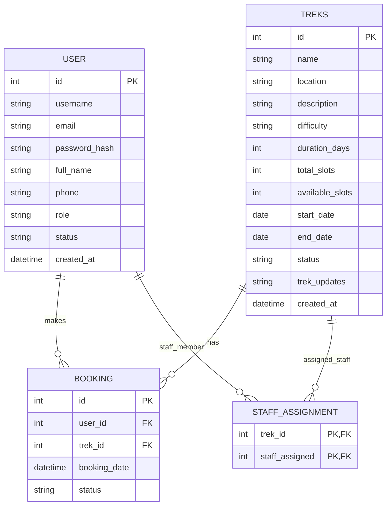

# ER Diagram

## Notes

- `STAFF_ASSIGNMENT.staff_assigned` points to `USER.id` and is intended for users with the `staff` role.
- `BOOKING.status` follows the `Booked`, `Cancelled`, and `Completed` convention used in the model.
- `USER.status` follows the `active`, `pending`, and `blacklisted` convention used in the model.